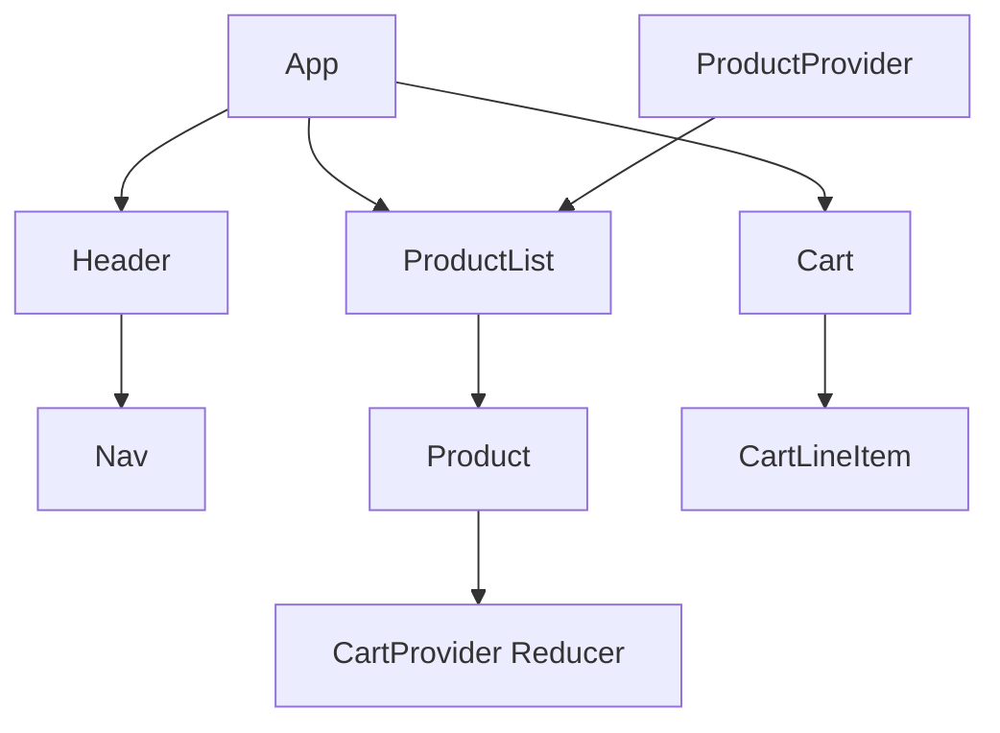

# Prime Co Shopping Cart Lab

> Modern retail preview built with React 19, TypeScript 5.9, and Vite 8 - a single-page dashboard that walks users through product discovery, cart management, and a mock checkout in under 30 seconds.

**Why it matters**
- Real-time totals plus reducer-backed cart state keep pricing accurate as visitors toggle between products and the cart view.
- Self-contained stack (static JSON catalog plus client-side logic) is ideal for prototyping checkout concepts before wiring in a backend.

## Getting Started
| Section | Anchor |
| --- | --- |
| Overview | [#overview](#overview) |
| Setup | [#setup](#setup) |
| Usage | [#usage](#usage) |
| Deployment | [#deployment](#deployment) |
| Visuals | [#visuals](#visuals) |
| FAQ | [#faq](#faq) |
| Notes | [#notes](#notes) |
| Contributing | [#contributing](#contributing) |

<a id="overview"></a>
## Overview
- **Goals:** Provide a lightweight shopping experience where visitors can switch between the product catalog and their cart, adjust quantities, and submit a mock purchase with immediate feedback.
- **Stack:** React 19 + Vite 8 (beta) + TypeScript 5.9 with `@vitejs/plugin-react` (plus `babel-plugin-react-compiler`) and ESLint 9.x.
- **Architecture:** `App` orchestrates `Header`, `ProductList`, and `Cart`. `ProductProvider` seeds data from `data/products.json`, and `CartProvider` exposes reducer actions (`ADD`, `REMOVE`, `QUANTITY`, `SUBMIT`). `Product` and `CartLineItem` are memoized to prevent needless re-renders, while `Nav` flips the `viewCart` toggle held by `App`.

> **Tip:** The cart context memoizes the action map so consumers can rely on stable identity when invoking dispatch.

<a id="setup"></a>
## Setup
### Prerequisites
-  Node.js LTS (Windows/macOS/Linux compatible)
-  npm 10+ (bundled with Node.js)

### Install & bootstrap
```bash
npm install
```
> The checked-in `node_modules` folder is for reference. Run `npm install` any time dependencies change.

### Configuration
- **Environment variables:** none required. The catalog is pulled from `data/products.json`, and images live under `src/images/{id}.jpg`.
- **Secrets:** there are no secrets; this is a purely front-end prototype.

### Build & tooling commands
```bash
npm run dev       # start Vite dev server (default http://localhost:5173)
npm run build     # build TypeScript project and bundle assets
npm run lint      # run ESLint over the repository
npm run preview   # serve the production bundle locally
```

<a id="usage"></a>
## Usage
1. Run `npm run dev` and open http://localhost:5173 in your browser.
2. Browse the product list. Each `Product` card renders a hero image (from `src/images/`), price formatting via `Intl.NumberFormat`, and an "Add to Cart" button.
3. Click **View Cart** to inspect line items.
   - Adjust quantities in the `<select>` dropdown (up to 20 or the current quantity, whichever is higher).
   - Remove items with the **delete** button.
   - Totals (`totalItems`, `Totalprice`) update via the `useCart` reducer state.
4. Click **Place Order** to dispatch `SUBMIT`, which clears the cart and surfaces a thank-you confirmation.

### Sample commands + expectations
- `npm run dev` -> Dev server logs `Local: http://localhost:5173` and the product tiles render.
- `npm run build` -> Emits the `dist/` folder and reports a successful bundle.
- `npm run lint` -> ESLint exits cleanly or reports files needing fixes.

### Health checks & verification
- Run `npm run build` and `npm run preview` to confirm the production bundle renders without TypeScript errors.
- There are no automated tests yet, so lint/build are the primary checks before shipping.

<a id="deployment"></a>
## Deployment
1. Install the deploy helper: `npm install --save-dev gh-pages`.
2. Update `vite.config.ts` with the repo’s base path so assets resolve on GitHub Pages (replace `your-github-repo` with your actual repo slug):

```ts
import { defineConfig } from 'vite'
import react from '@vitejs/plugin-react'

const repoName = 'shopping-cart'

export default defineConfig({
  base:
    process.env.NODE_ENV === 'production' ? `/${repoName}/` : '/',
  plugins: [
    react({
      babel: {
        plugins: [['babel-plugin-react-compiler']],
      },
    }),
  ],
})
```

3. Add deploy scripts and (optionally) a `homepage` field to `package.json`:

```json
"homepage": "https://<your-github-username>.github.io/<your-repo-name>",
"scripts": {
  "predeploy": "npm run build",
  "deploy": "gh-pages -d dist",
  ...
}
```

4. Push the repo to GitHub, then run `npm run deploy`. The `gh-pages` package will publish `dist/` to the `gh-pages` branch, and GitHub Pages will serve it from `https://<your-github-username>.github.io/<your-repo-name>/`. Verify the settings under the repository’s “Pages” section in GitHub so the branch + folder are correct.

<a id="visuals"></a>
## Visuals

*Caption: Placeholder hero image used by each product card (IDs 1-3). Update these JPGs when brand assets are available.*


*Caption: Component/context topology. `ProductProvider` seeds the catalog, while `CartProvider` exposes reducer actions consumed by `Product` and `CartLineItem`.*

<a id="faq"></a>
## FAQ
#### How do I deploy this bundle?
Run `npm run build` to produce the `dist/` folder and deploy it to any static host (Vercel, Netlify, GitHub Pages). Use `npm run preview` to verify the minified output before publishing.

#### Why do totals reset when I click Place Order?
The `SUBMIT` reducer action clears the cart array. It stands in for a real checkout API response. Extend the action to call a backend before emptying the cart if needed.

#### What if I need a real products API?
Replace the hard-coded `initState` in `ProductsProvider.tsx` with a fetch guarded by `VITE_PRODUCTS_URL` (the fetch block is already commented out). Add the env variable and error handling so the UI can fall back to `data/products.json` when the request fails.

<a id="contributing"></a>
## Contributing
- **Code style:** Follow the TypeScript + React 19 conventions. Keep reducers pure, and memoize components when derived props are passed in.
- **Testing:** There are no automated tests yet. Run `npm run lint` and `npm run build` locally before opening a PR.
- **Workflow:**
  1. Fork/clone the repo and run `npm install`.
  2. Work in a feature branch named `codex/<feature>`.
  3. Run lint/build before committing.
  4. Open a PR describing the goal, the commands you ran, and any visual changes.
  5. Add screenshots or recordings under `public/` if the UI changed.

<a id="notes"></a>
## Notes
- **Assumption:** The static `data/products.json` dataset is currently authoritative; no remote catalog exists yet, so the app ships with three demo products and matching JPG placeholders (`src/images/1.jpg`, `2.jpg`, `3.jpg`).
- **TODO:** State is not persisted; the cart resets on refresh because everything lives in React context only.
- **TODO:** Add automated tests (unit for reducers and E2E for the cart flow) to harden the experience before wider release.

## Next Steps
1. Replace the static catalog with a fetch to `VITE_PRODUCTS_URL` while falling back to the bundled JSON when the network call fails.
2. Persist cart state (LocalStorage, session storage, or backend) so visitors can reload without losing their order.
3. Add automated tests and expose `npm run test` once the suites are in place.
